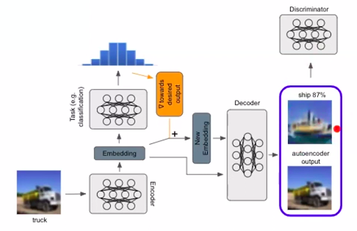
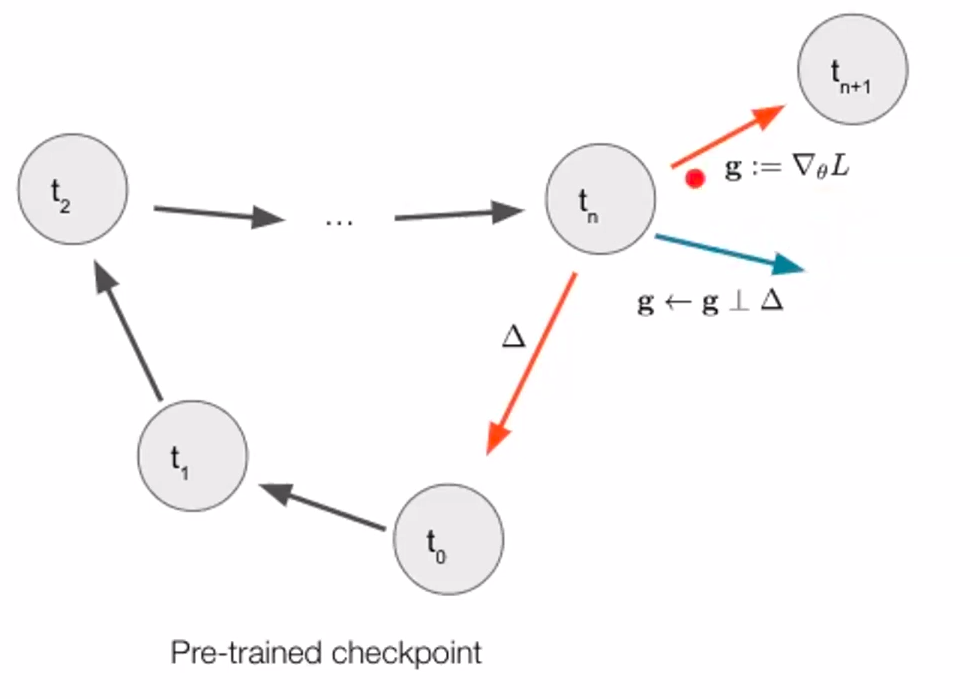

# Mini Project 1 - CMSC818B Decision Making for Robotics

### Author: Mudit Singal (msingal@umd.edu)

## ICRA 2023 Workshop - ScalableAD
_This workshop presents good literature related to solving challenging problems in Autonomous Driving Systems_
 
[ScalableAD website](https://sites.google.com/view/icra2023av)

The ICRA workshop on scalable autonomous driving addresses some of the biggest and complex challenges that are being faced while developing autonomous vehicles. The issue of scalability has been considered from various viewpoints in robotics in this workshop. The viewpoints span from issues in generating rare driving scenarios for training autonomous agents, developing new perception techniques that can fuse multiple sensor information, to connected autonomous vehicles (AVs).

The scalability issue of AVs  is of utmost importance if we wish to deploy them at scale in multiple cities across the globe. As we find more efficient methods for solving different problems faced by AVs, such as generating BEV (Bird’s Eye View) by fusing multiple on-board sensors, our ability to test and enhance such methods should also improve. This is only possible if we consciously push towards more scalable algorithms and techniques that are designed for AVs. By having scalable technologies, we can ensure that the solutions devised are globally optimum and generalize well across different scenarios that the autonomous agent may face while driving.

### Index:
1. [Open Challenges in Autonomous Driving](#oc)
2. [Examples of how discussed topics are related to decision making in robotics](#eg)
3. [F2BEV: Bird's Eye View Generation from Surround-View Fisheye Camera Images](#topic1)
4. [Scaling AV through Adversarial Scenario Generation and Continual Learning](#topic2)
5. [A V2V-based Collaborative Navigation Framework for Connected Autonomous Vehicles in Occluded Scenarios](#topic3)
6. [Label efficient Machine Learning for Autonomous Driving](#topic4)
7. [BEVFusion: Multi-task Multi-sensor fusion with Unified Bird’s Eye View representation](#topic5)
8. [Concluding Remarks](#conclusion)
9. [References](#refs)

### Open Challenges in Autonomous Driving.

Some of the major challenges in large scale deployment of AVs today are handling large amounts of data from multiple sensors, ensuring sample diversity for good generalizability of trained model, vehicle-to-vehicle communication, and handling occluded intersections.

Modern AVs have a host of multi-modal sensors ranging from 2D cameras to LiDAR. Such a large array of sensors is required to introduce fail-safe redundancies in the system. While this approach does ensure safe operation of AVs in case of sensor failure, it also warrants the development of computationally efficient algorithms. Such algorithms should be capable of generating a representation that can then be used by other latency-critical algorithms, such as the path planning module. The literature discussed in later chapters goes over construction of such representations, which help in preserving semantic and geometric information. This property ensures usability in applications such as 3D object detection and semantic segmentation.

Another open problem is handling occlusion. There are many approaches that are being studied. Most of them involve some form of learning, such as reinforcement learning and learning from demonstrations. However, these approaches lack the element of communication. If multiple AVs at different parts of an intersection share their representations of their surroundings, each AV can benefit from a bigger picture of the environment. The major issues of such a system are bandwidth-efficient data representation techniques that can minimize network latency for real-time applications.

### Examples of how discussed topics are related to decision making in robotics

To make good decisions, robots or agents must have access to reliable information about their surroundings and their state. One topic that will expand upon this area is bird’s eye view (BEV) generation using surround-view fisheye cameras. BEV is ideal for analyzing vehicle motion using sequences of images. Thus, accurate BEVs are essential for good vehicle motion profiling and good robot decision making.

Further, for learning based approaches, well distributed samples, covering a large range of scenarios, are necessary for good generalization. A good example of how this could be difficult to ensure is rare pedestrian behavior. A pedestrian may decide to stop and go back to where he/she came from or stumble and deviate from a straight path. These cases may be hard to capture, model, or program explicitly. Thus, by using adversarial scenario generation, GANs can be used to generate realistic rare pedestrian behaviors that ensure that the underlying neural network has access to well distributed samples that cover a wide range of examples.

### Topic 1: F2BEV: Bird's Eye View Generation from Surround-View Fisheye Camera Images for Automated Driving.[1](#ref1)

In [1](#ref1), Samani, et. al. propose a baseline algorithm to generate BEV (Bird’s Eye View) representation constructed from surround-view fisheye cameras. As more and more AVs (Autonomous Vehicles) are deployed, the higher dependency on vision based sensors and ranging sensors is bound to grow exponentially. This higher demand may lead to bottlenecks in sensor supply chains, causing deployment delays and increasing cost of AVs for the users. Using fisheye cameras, fewer cameras are needed to capture the entire surroundings of an AV. Thus, by reducing the number of cameras, hardware requirements and possible points of failure are reduced.

The paper has 2 major contributions in the area of generating BEV. Firstly, they propose the baseline model F2BEV that generates BEV from Fisheye cameras. This method is the first algorithm that works on creating BEV using distortion aware models. The existing models work by undistorting the images from fisheye cameras and then proceeding with traditional methods for BEV generation. By using this novel approach, the authors outperform not only the approaches for BEV generation from fisheye cameras, but also BEV generation from traditional pinhole cameras. The authors also consider single-task and multi-task maps. In single-task maps, a single map (such as just the height map or the semantic segmentation map) is generated by one pass of the network. In multi-task map, both the height and segmentation maps are generated simultaneously. It is found that the performance of single-task and multi-task approaches are similar, while the multi-task approach provides significant performance boost over single-task map generation.

Secondly, the authors have created a dataset - FB-SSEM dataset. This dataset consists of images from four surround-view fisheye cameras, the motion information of the ego vehicle, ground truth BEV semantic segmentation and height map. The dataset consists of 20 sequences of an ego vehicle in different parking lots, where each sequence consists of 1000 temporal samples. The temporal information is necessary for generating accurate BEVs. This dataset attempts to fill the disparity between the size of datasets between BEV maps and F2BEV maps for public use.

In my opinion, this research helps in solving a very important issue: reducing the number of sensors required to perform autonomous driving. A famous quote by Elon Musk says that we won’t need any other sensors once we solve vision. I think this is true because as humans we only have access to vision sensors (our 2 eyes) to perceive threats around us, and we are rather good drivers. Hence, an autonomous agent, whose sole purpose is to drive, should be able to do so with just surround view cameras. This also reduces the potential points of failure and the processing resources required. 

I also believe that the authors provide a good starting point for further research in generating BEV from wide angle cameras. Better performing and more efficient algorithms can certainly be developed from this point on. The dataset developed (SSEB dataset) should be further expanded to incorporate more scenarios and classes of objects (currently only 5 classes are included).

Open challenges: Baseline, hence computational performance needs to be analyzed. For real time applications, the algorithm should be computationally efficient to allow deployment on-board actual AVs. Thus, a study should be conducted that assesses the latency introduced by the proposed algorithm and what potential improvements can be made to make it more efficient. Further, the authors only consider 5 classes for semantic segmentation and only 3 levels in height map generation. This level of granularity may be insufficient for deployment of the algorithm in complex and rich city environments. Thus, a more comprehensive class set can be explored.

### Topic 2: Scaling AV through Adversarial Scenario Generation and Continual Learning.
_Talk by: Yuning Chai (Head of AI Research at Cruise)_

Dr. Chai talks about how generating adversarial scenarios using GANs can help in providing additional learning examples for the agent. He addresses how generative AI can be used to provide a scalable technology that can generate good training data. This is essential to help in expanding the categories of scenarios that are available as training data. 

Modern neural networks are composed of billions of parameters that are very data hungry and need large amounts of data (often in terabytes or even petabytes) to generalize well. The talk  proposes a method of multi-pass learning in which we can eliminate the need of storing old data without sacrificing the performance metrics on old data. This helps in solving the scalability issue in continual learning in AI models.

Generative AI paves the way to generate realistic examples in high-dimensional spaces such as RGB images or 3-dimensional paths. The talk makes an important contribution of using generative AI to generate realistic but improbable pedestrian behavior. This has been accomplished by modifying the architecture of the generator of a traditional GAN where a single neural network is used to produce the output. Here, an encoder and a decoder are used to make up the generator network. An additional embedding is generated from the desired distribution and passed to the decoder that generates an output sample (as seen in fig. 1). By using this method, the authors improve the chances of obtaining ‘valid’ samples that will be more suitable candidates for training the underlying neural network.

  
   
  <em>Fig 1: Modified GAN architecture</em>

Another important contribution in the area of continual learning of neural networks has been made. In most approaches, access to old data (not for retraining, but for evaluation) is often required or the approach is not scalable to multiple fine-tuning stages. In the proposed method, the weight updates are made based on only the new data but using the original checkpoint model’s weights as reference. An example can be seen in fig. 2, where the weight updates are calculated by a combination of gradients obtained from the current model and new data and the difference between the current model and check-pointed model. Using this method, the need to store old data is eliminated while ensuring that the model does not ‘forget’ the old data.

  
   
  <em>Fig. 2: The idea of PC grad</em>

I believe that the presentation fits well in the context of scalable AI. The authors not only introduce an important issue when dealing with scalable autonomous driving systems, but present interesting approaches towards solving it. The idea of generative AI being used to generate training samples in the context of robotics is gaining traction. It is being used in CNNs, path planning, RL-based control systems, and as already mentioned, in autonomous driving systems. This is important because collecting data for robotic systems is often a laborious task and consists of data from multiple sensors. Thus, collecting real-world data for unlikely scenarios may not be feasible for many applications. If generative AI can help in generating realistic data that is well diversified, the time-to-market can be significantly improved while ensuring that the model can generalize to complicated scenarios. However, a quantitative quality-of-sample should be established for applicability of the proposed method in real-world scenarios.

Further, in the context of continual learning, elimination of dependence on large amounts of data is essential in the longer term, however, the talk does go into a lot of detail regarding the performance benefits of PC grad when compared to other approaches. The idea is enticing and I believe that further analysis should be done to conclude the efficacy of the proposed method.

Though Dr. Chai addresses important issues towards scalable autonomous driving, additional research is necessary to measure and ensure the diversity of samples generated. Generative AI is difficult to train and can lead to inaccurate samples that might misguide the learning process. A metric to measure the ‘validity’ of generated samples should be devised which could help in discarding invalid samples. Such a metric would enable researchers to analyze the distribution of output generated by the AI and further tweak the AI to give more evenly distributed samples that constitute a varied set of scenarios.

### Topic 3: A V2V-based Collaborative Navigation Framework for Connected Autonomous Vehicles in Occluded Scenarios.[3](#ref3)

The context of Connected Autonomous Vehicles (CAVs) is an emerging and important topic in the development and deployment of AVs on a large scale. As more and more AVs begin getting deployed, we can leverage the increased number of AVs to form local networks of information sharing between AVs. This is the whole context of CAVs, where two or more AVs are connected through either a central network (such as all vehicles in a city) or through a local network (such as at an intersection). Such an approach allows AVs to not only make decisions based on the data acquired using on-board sensors, but also take advantage of other AVs around the ego vehicle to get more information about the environment. This allows for safer operation and increased road usage efficiency.

The main contribution of [3](#ref3) is in the area of CAVs, where the authors propose an efficient framework for coordinating between multiple AVs and execute a policy to minimize the collision probability and maximize the traffic throughput. This achievement can be viewed in three stages: 
The authors designed a custom Gym environment for Occluded Intersections based on CARLA sim and OpenCDA framework. This was done as there was no available simulator that would facilitate information sharing between vehicles while ensuring high fidelity lidar data representation. The experimentation was done using this custom environment.
To share data efficiently between vehicles, the authors compress the extracted features from the LIDAR data using DRACO 3D compression algorithm. This reduces the network bandwidth requirement by 40 times hence ensuring better performance during the experimental phases.
By using MAPPO (Multi-Agent Proximal Policy Optimization) algorithm, the agents find optimum optimum policy by utilizing all the information available on-board and through shared information. This has reportedly reduced the collision rate by over 70% when compared to rule-based methods. The proposed method also improves average speed of the ego vehicle by 12% which translates to higher traffic throughput.

From my perspective, the fact that there are limited simulation platforms that enable testing of CAVs leads to inferring that one could further develop such coordinated technologies. The authors design a custom gym environment which can be used to train MARL agents in autonomous driving. As per the authors, this was necessary as no existing simulator provided the set of configurations that were necessary for this study. If this is indeed the case, then the field of CAVs has a potential to make important contributions that have a huge impact on industry and academia. Further, limited studies on CAVs, with majority of them being focussed on scheduling schemes through a global controller, imply that further development is needed in this area.

Due to the nacency of the field, I think there are a number of improvements and limitations in the study. Firstly, in the custom environment created, efficacy of the reward function needs to be investigated. Every RL researcher/enthusiast is aware that finding a good reward function is like finding a needle in a haystack. It requires numerous iterations and experimentations. The proposed reward function may be a decent function, but a better reward function may be found that leads to faster convergence and more stable training. 

Another vital issue is that only one sensor, i.e. lidar, is being used. If the sensor fails or its performance metrics dip due to any reason, the entire system may be rendered useless. LiDAR sensors can fail due to multiple reasons such as inclement weather, hardware malfunction, or external blocking of the sensor due to obstacles/dirt in the environment. Hence, some redundant sensors should be fused to make the system more robust.

In CAVs, network latency is an important factor. If there is a significant delay in transporting critical information, this could lead to catastrophic outcomes. While the authors propose data compression, a network latency performance metric should be measured to ensure optimum performance for critical operations.

### Topic 4: Label efficient Machine Learning for Autonomous Driving. [4](#ref4)

_Talk by Yin Zhou (Senior Staff Research Scientist at Waymo)_

Accurate labeling is critical for training machine learning models that behave in a predictable manner and produce the desired outputs. Being a critical component of machine learning, it is usually carried out manually, where human experts spend a huge amount of time on annotating and labeling different classes of data such as pixel level segmentation for semantic segmentation tasks. For large datasets, the cost of labeling data grows exponentially, limiting the size of datasets that can be produced for training complex neural networks. Thus, to help alleviate this scalability problem, many auto labeling algorithms are being developed that utilize neural networks to automatically and accurately annotate the data from different categories of data.

In the talk by Dr. Yin Zhou, senior staff research scientist at Waymo, about label efficient machine learning for autonomous driving, he talks about the Waymo open motion dataset. ML models trained using this dataset can match the performance of common use cases when comparing with 100% labeled data, however, there is a significant performance gap when compared for rare cases such as large vehicles (trucks, buses). This performance gap is bridged by using a technique called rare-example mining, in which rare data points are sent back to humans to label manually. To quantize the rareness of an object, a probability density of samples is computed, and the samples with low probability are considered to be more rare and sent to humans for manual labeling. In this way, we can get better labeling accuracy for all use cases and frees humans from repeated labeling of common cases (cars, pedestrians). This technique improves trained model accuracy by ~40% for long-tail cases.

The talk also goes over how the addition of rare examples helps in improving data distribution and reducing epistemic uncertainty but not improving aleatoric uncertainty. That is, samples with sparse point clouds are inherently hard to label even for humans. To reduce aleatoric uncertainty, a novel motion forecasting algorithm is proposed which they have named MoDAR (Motion Forecasting for 3D Object Detection in Point Cloud Sequences). In this algorithm, previous examples where object detection was successful are used to extrapolate points from possible motion paths. Several motion paths are considered based on common vehicle motion hypotheses used by Waymo. This algorithm helps in adding the missing points in 3D point cloud data due to occlusion or external sensor blockage. Thus, SWFormer’s (Sparse Window Transformer for 3D object detection in point clouds) performance with MoDAR outperforms current state-of-the-art consistently (3-7% improvement L3 APH metric for pedestrian and vehicle detection).

I believe that both the topics touched by Dr. Yin Zhou solves important problems for deploying machine learning for autonomous vehicles at scale. Research on auto-labeling algorithms is being done in multiple fields, not just limited to robotics. The proposed method comes close to matching the performance of labeling using human experts, and further research in the area could help in surpassing human experts as seen in reinforcement learning cases.

Further, measurable improvement in the case of pedestrian and vehicle detection over current state-of-the-art is a big accomplishment. The successful implementation of augmented point cloud using historical detections is a big step towards improving the safety of autonomous vehicles. This is similar to how humans reason. If a smaller vehicle is occluded by a larger vehicle or static obstacles, we try to keep a mental picture of where they might end up after the next 5-10 seconds. 

The potential challenges or improvements in the proposed algorithms are mainly related to scalability issues and timing constraints. While MoDAR is an innovative approach, it requires extrapolation of sequences of 3D point clouds. This is bound to be computationally expensive and may not be suitable for real-time use cases and in time-constrained environments, such as emergency driving maneuvers required in real-life driving scenarios. Thus, further improvements in computational efficiency can be made. For the case of label efficient machine learning, a huge scope in labeling accuracy exists, as the objective is to beat the human expert. Currently, no such algorithm exists.

### Topic 5: BEVFusion: Multi-task Multi-sensor fusion with Unified Bird’s Eye View representation.[5](#ref5)

Most modern autonomous driving systems consist of a large suite of sensors that permit collection of data of different modalities such as semantic data from cameras and geometric data from LiDAR sensors. Further, the presence of additional sensors is necessary to have multiple redundancies in the system to account for potential sensor failure. Such a large number of sensors on-board lead to generation of tremendous amounts of data that has to be processed in real-time for smooth operation of the system. Thus, efficient algorithms are needed that can ingest this large amount of data generated by the sensors and compute the appropriate commands to the vehicle for a comfortable and safe customer riding experience. The selected paper presents a state-of-the-art algorithm that can efficiently and accurately fuse together data from different sensors to create a unified BEV (Bird’s Eye View) representation.

The main contribution of this paper is in the area of a unified representation of multi-modal sensor data. Most existing work focuses on sensor-fusion done in the 3D point cloud obtained from LiDAR scans. This is a semantically lossy task as typically 5% of camera information is represented in the augmented point cloud. The proposed algorithm performs sensor-fusion in BEV. The 3D lidar scans are projected to the z=0 plane and a BEV transformer is used to convert 2D perspective images to BEV representation. While a few existing methods produce BEV representation from multiple sensors, the key improvement lies in the performance enhancement achieved by the authors. BEV pooling is the major bottleneck while computing the BEV representation. By using a combination of precomputation (computing some common transformation information for 3D coordinates of image pixels) and interval reduction (GPU parallelization for computing BEV grids), the authors have improved camera-to-BEV transformation by 40 times.

The proposed algorithm, in my opinion, is a suitable candidate for establishing a baseline algorithm for multi-sensor fusion BEV generation. Not only does this algorithm outperform the existing methods in tasks like 3D object detection and semantic segmentation, but it does so in almost real time. The algorithm is currently ranked 5th in nuScenes 3D object detection and BEV map segmentation (nuScenes has 40,000 annotated scenes for different driving conditions in city landscapes). Further, I believe that most commercial products revolving around autonomous driving, will have redundant sensors to mitigate risk of sensor failure (worst case scenario). Thus, having efficient algorithms that can leverage the availability of multi-modal sensor data is critical for large scale deployment of autonomous vehicles.

Testing of the algorithm has to be carried out on actual hardware on the road to gauge its effectiveness in the real world. Not a lot of information is given about performance of the algorithm when using a combination of sensors other than 2D cameras + LiDAR. Hence, further investigation is needed when performing sensor fusion with sensors such as radars and depth cameras.

### Concluding Remarks

Decision-making in robotics heavily relies on the quality and availability of unbiased and error-free data. If the underlying data accessible to the agent at any given point in time is erroneous, the agent is prone to making faulty decisions and predictions. The primary focus of this study was to explore how existing algorithms could be enhanced or new algorithms developed to ensure the availability of high-quality data for unbiased decision-making. While the majority of the study doesn't directly contribute to decision-making in robotics, one can assert strongly that data is the foundation of decision-making in this field. The study doesn't introduce groundbreaking algorithms that enhance existing decision-making algorithms like PPO (Proximal Policy Optimization). Instead, it presents algorithms designed to assist existing algorithms in making the correct decisions by providing an accurate representation of the vehicle's surroundings.

The proposed algorithms and methods in this study examine data representation from various angles. The major perspectives include:

1. Generating accurate Bird's Eye Views (BEVs) from fewer cameras, reducing the need for expensive LiDARs and eliminating redundancy.
2. Generating rare driving scenarios using neural networks, scenarios that are challenging to record or program explicitly.
3. Representing environment scans in a format suitable for quick sharing over a local network of autonomous vehicles (AVs), thus reducing network overhead and improving throughput. Sharing information also aids in obtaining a more comprehensive view of occluded parts of the environment.
4. Auto-labeling techniques for autonomous driving data to reduce human dependency and expand the size of available training datasets.
5. Sensor fusion techniques that efficiently create a unified representation of the environment from multi-modal data, suitable for quick decision-making in complex scenarios.

All of these discussions address crucial aspects of data representation and management to enhance decision-making in autonomous vehicles. Ongoing research will further refine these methods and contribute to making autonomous vehicles a universal concept that can be scaled  as needed.

### References:
<ol>
  <li>
    Samani, Ekta U., Feng Tao, Harshavardhan R. Dasari, Sihao Ding, and Ashis G. Banerjee. "F2BEV: Bird's Eye View Generation from Surround-View Fisheye Camera Images for Automated Driving." arXiv preprint arXiv:2303.03651 (2023).
  </li>
  <li>
    Talk 1: Scaling AV Across the US by Dr. Yuning Chai. ScalableAD workshop ICRA'2023.
  </li>
  <li>
    Leandro Parada, Hanlin Tian, Jose Escribano, and Panagiotis Angeloudis. "A V2V-based Collaborative Navigation Framework for Connected Autonomous Vehicles in Occluded Scenarios.".
  </li>
  <li>
    Talk 2: Label efficient Machine Learning for Autonomous Driving by Dr. Yin Zhou. ScalableAD workshop ICRA'2023.
  </li>
  <li>
    Liu, Zhijian, et al. "Bevfusion: Multi-task multi-sensor fusion with unified bird's-eye view representation." 2023 IEEE International Conference on Robotics and Automation (ICRA). IEEE, 2023.
  </li>
</ol>

